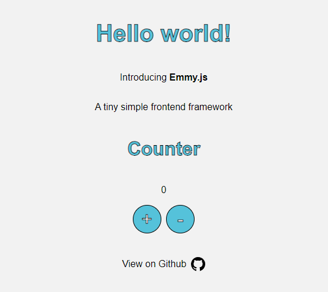

# Emmy.js

A tiny simple frontend framework for building web applications.

## Quick Start

First clone the repository:

```bash
git clone git@github.com:eanorambuena/Emmy.js.git
```

Then, launch a development server with your favorite tool. For example, with [http-server](https://www.npmjs.com/package/http-server):

That's it! You can now start building your application.

You will see the following on your browser:



## Release Notes
### 0.0.1a2
It includes the following features:
1. [Component Class](docs/0.0.1a2/component-class.md) 
2. [Launch Function](docs/0.0.1a2/launch-function.md)
3. **BREAKING CHANGE**: The `Component.newButton` method has been removed. Use the `callback` argument of the `Component.render` method instead.
4. **BREAKING CHANGE**: The style objects are no longer supported in `Component.addStyle` method. Use style strings instead.
5. **FIX**: The shadow DOM is now correctly updated when the `Component.render` method is called.

#### Examples
1. [Counter](docs/0.0.1a2/examples/counter.md)

### 0.0.1a1
First pre-release version of Emmy.js. It includes the following features:
1. [Component Class](docs/0.0.1a1/component-class.md) 
2. [Launch Function](docs/0.0.1a1/launch-function.md)

#### Examples
1. [Counter](docs/0.0.1a1/examples/counter.md)
